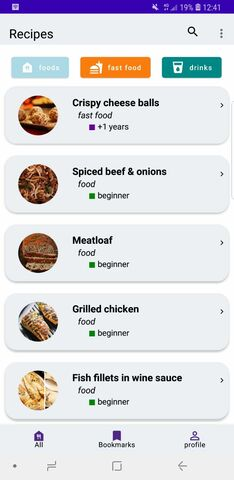
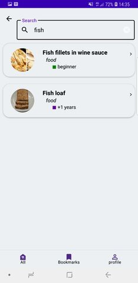
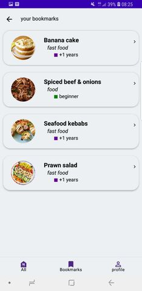
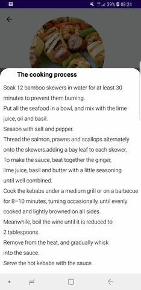

# Recipe App for Android

This Android app utilizes Volley to fetch data from a database powered by Laravel. The app seamlessly retrieves and 
displays the latest data in real-time, 
-With a simple and intuitive interface, users can browse, search and save their favorite recipes with ease.

#Screens

Home screen

All Recipes

Search page

Added bookmarks

food more details

Cooking process

## Features
- Browse and search for recipes by category, ingredient or keyword
- View detailed recipe instructions and ingredients
- Save and organize your favorite recipes
- search for any recipe from our database
- Share recipes with friends and family

## Getting Started
1. Download and install the Recipe App from the Google Play Store 
2. Browse and search for recipes to your heart's content
3. Save your favorite recipes for easy access later on
4. Start cooking and enjoy delicious meals!

## Contributing
The app was built using Java and Android Studio, with Volley handling the data retrieval and Laravel powering the backend database.
If you would like to contribute to the development of the Recipe App, please reach out to us. We would love to hear from you!
This README file provides a brief overview of the features and functionality of the recipe app, as well as instructions on how to get started using it. The images help give a visual representation of what the app looks like and what it can do.

